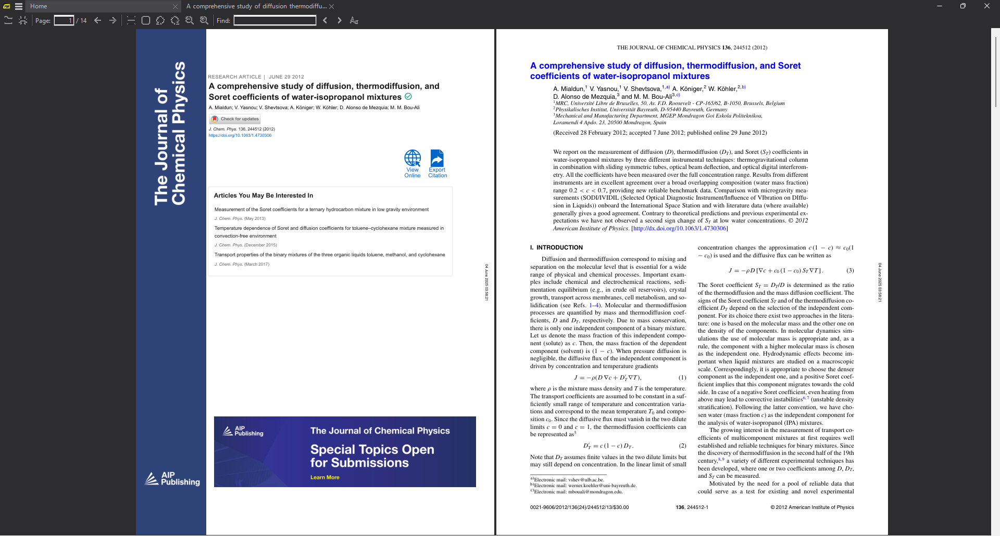
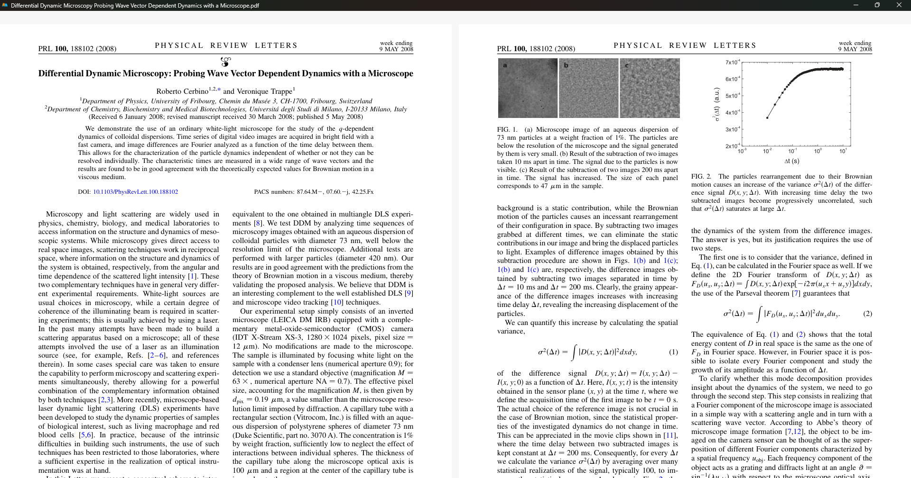
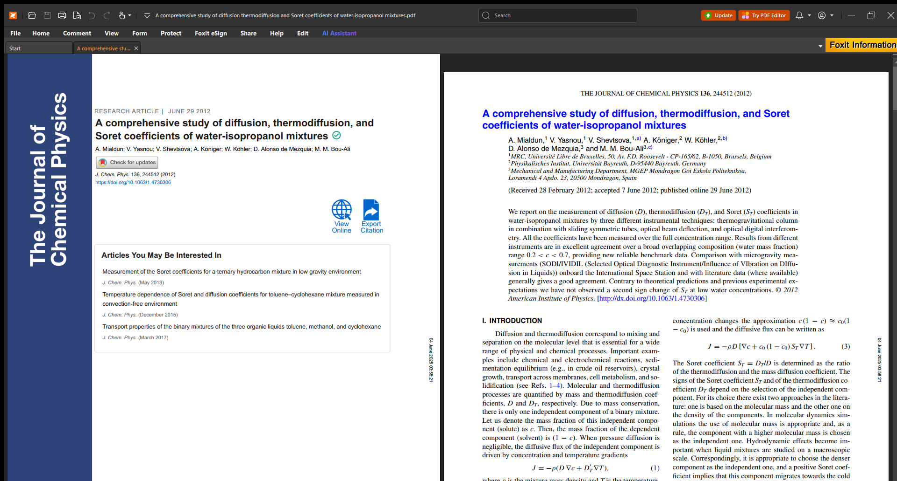
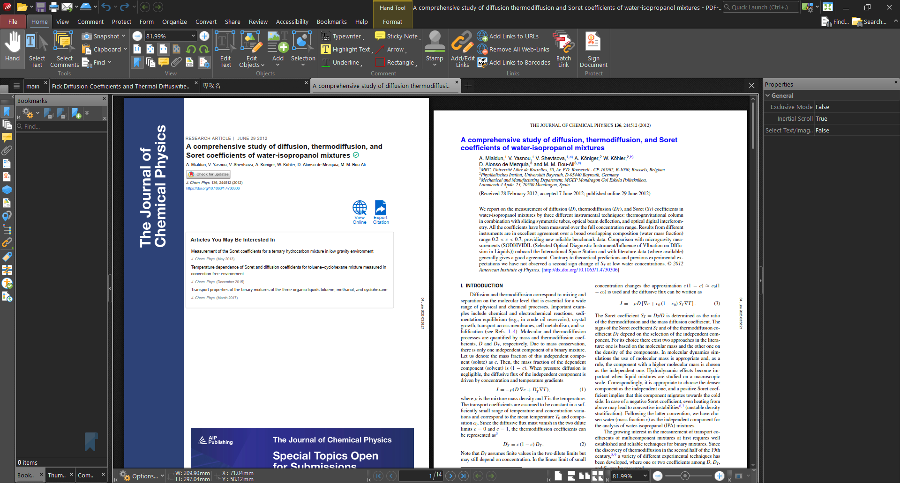
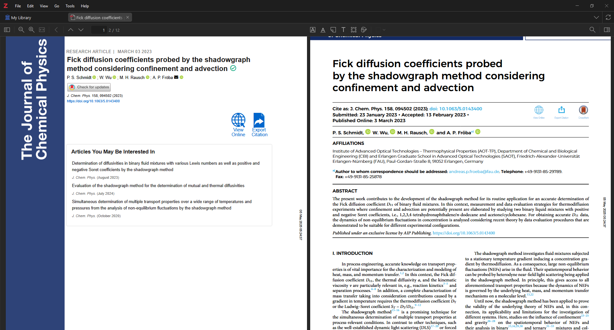

## [SumatraPDF](https://www.sumatrapdfreader.org/free-pdf-reader)

シンプルなPDFビューア．何よりも軽快な動作が特徴．後述するFoxit PDF Readerよりはできることは少ないが，PDFを閲覧するだけなら十分な機能を備えている．また，SyncTeXに対応しているため，VS CodeでTeXファイルを編集しているときに，PDFを自動で更新してくれる．VS Codeは割とメモリを食うため，軽量なSumatraPDFとの相性は非常にいいと思う．

 

## [Sioyek](https://sioyek.info/)
> Sioyek is a PDF viewer with a focus on technical books and research papers.
> ―― Sioyekは技術書や研究論文に特化したPDFビューアである．（[公式サイトより](https://sioyek.info/)）

SioyekはシンプルなUIが特徴である．SumatraPDFほどではないが，動作も十分に軽快．公式サイトでは以下のような特長を挙げている．

* **Searchable**: 以前開いたファイル，目次，ブックマーク，ハイライトを素早く検索できる．また，目次を持たないファイルに対して，それを自動生成する機能を有する．
* **Smart Jump**: リンクがない引用，図，数式でもプレビューすることができる．ワンクリックで引用文献をGoogle Scholar（他の検索エンジンに変更可能）で検索することも可能．
* **Portals**: これが非常に強力な機能．ファイルのある場所から別の場所へ飛ぶ「ポータル」を別ウィンドウで作成できる．文章中に「図1より～」とあっても，図1のポータルを作成しておけば，いちいちマウススクロールをしなくてもワンクリックで図1を参照できるのが大きな利点．
* **Keyboard Focused**: マウス操作は当然できるが，キーボード操作も充実している．基本的にはVimのキーバインドと似通っているため，扱いやすい．
* **Synctex**: SumatraPDFと同様，SyncTeXに対応している．
* **Configurable**: `prefs.config` と `keys.config` ファイルを編集することで，細かいUIやキーバインドの設定を行える．ちなみにダークモードにも対応している．
* **Extensible**: 外部コマンドやスクリプトを利用できる．例えば，OCR，翻訳，Text-to-Speechなどの機能を外部コマンドで実装可能．

個人的には，シンプルなUIとポータル機能が非常に魅力的である．特に，技術書や研究論文を読む際には図や数式を参照することが多いので，ポータル機能は非常に重宝する．SumatraPDFと比べると若干重くはなるが，気にするほどではないと思う．

 

## [Foxit PDF Reader](https://www.foxit.com/pdf-reader/)

多機能なPDFリーダー．PDFの閲覧だけでなく，注釈の追加やPDFの編集も可能．SumatraPDFと比べると流石に動作は重いが，機能は充実している．ファイルの共有，電子署名，AIアシストなど．あまり深く使ったことがないので，多くは語れない．

 

## [PDF-XChange Editor](https://www.pdf-xchange.jp/)

PDF-XChange Viewerの後継ソフト．PowerPointと同じくリボンUIを採用しているため，好みに合う人には使いやすいかもしれない．Foxit PDF Readerと大体同じ機能を持っていると思うが，割とUIを自由にカスタマイズできるのが強み．買い切りの有料版もあるので，使いやすければ購入を検討してもいいかもしれない．Adobeと違ってサブスクリプションではないのが良い点．

 

## [Zotero](https://www.zotero.org/)

オープンソースの文献管理ソフト．厳密にはPDFビューアではないが，PDFを閲覧する機能も備えているため紹介する．
論文管理ソフトとしてはEndNoteやMendeleyなどが挙げられるが，自分はZoteroしか使ったことがない．無料でダウンロードできる割に優秀すぎる機能を揃えている．PDFをキーワードでタグ付けして，すぐに検索できるのがかなり便利．また，自分は複数のPCで作業しているため，デバイス間でデータを同期してくれるのもポイントが高い．様々な引用スタイルのサポートや，Google Chrome拡張機能などもあるため，論文管理ソフトの1つ目として強くお勧めできる．

---

論文管理するときはZoteroを，PDFを読んだりTeXファイルを編集したりするときはSumatraPDFを使っていたが，最近はSumatraPDFの代わりにSioyekを使うことが多くなった．特に，技術書や研究論文を読むときには，Sioyekの方が圧倒的に便利だと感じている．
